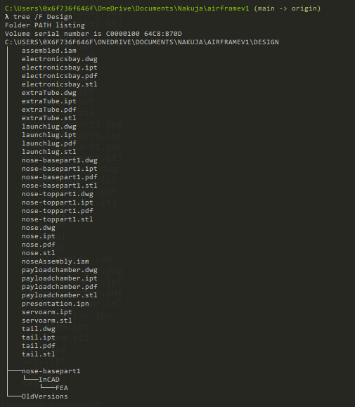

# Airframe version 1

This is project repo for the airframe containing all our design and simulations for the model rocket

[](https://github.com/nakujaproject/airframev1/actions/workflows/changelog.yml)
   

## Table of contents

* [General info](#general-info)
* [Technologies](#technologies)
* [Setup](#setup)

## General info

This project is where our design files for the nakuja N1 rocket are placed. I designed tha parts of the rocket using `Autodesk Inventor 2020`.

## Technologies

Project is created with:

* Autodesk Inventor 2020
* VScode

## Setup

To run this project, install it locally using Inventor:

```bash

$ git clone https://github.com/nakujaproject/airframev1
$ cd airframev1
# Open Autodesk Inventor 2020 and open the design files

```

* **.ipt** These are the part files for the various parts of the N1 rocket model.

* **.stl** These are the 3D files of the respective parts.

* **.iam** These are the assembly files of the N1 rocket.

* **.dwg** These are 2D drawing files of the repective part files.

* **.pdf** These are pdf files for the repective 2D drawing files.

## Current directory structure

* **assembled** This is the assembled file for the N1 rocket

* **electronicsbay** This is the electronics bay where the electronics components will be attached

* **extraTube** This is the extratube that provides enough stability for the rocket

* **launchlug** This helps guide the rocket during launch

* **nose-basepart1** This is the base part of the nose that attaches to the body

* **nose-toppart1** This is the cover for the nose cone

* **noseAssembly** This is the nose cone assembly

* **payloadchamber** This is the chamber where the electronics bay will go in

* **presentation** This is the presentation for assemblying the N1 rocket

* **servoarm** This the extra arm added to the servo motor to ensure the cover closes

* **tail** This is the tail of the rocket intergrated with the fins


